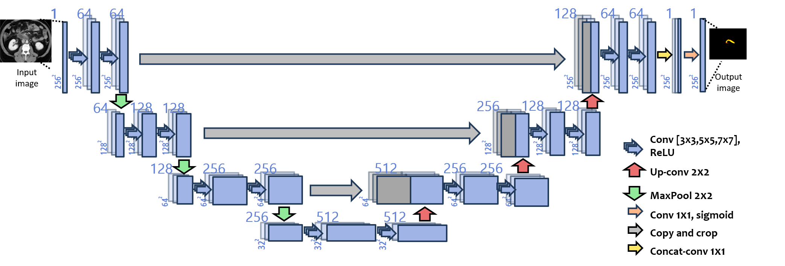

# PancreasUnet
### Multi U-Net based Model for Pancreas Segmentation

* 복부 CT영상 내 췌장 자동 탐지용 딥러닝 모델 성능 개발
* Dataset : [Pancreas-CT](https://wiki.cancerimagingarchive.net/display/Public/Pancreas-CT)
* Baseline Model : [Baseline Model](https://github.com/snapfinger/pancreas-seg)   



### [Environment/Dependencies]   

CUDA 10.1
GPU : Geforce GTX 1080 Ti
Python : 2.7
Tensorflow – gpu : 1.3.0
Keras : 2.0.8
numpy : 1.13.1
pandas : 0.20.3
matplotlib : 2.2.3

### [Directory]   

data, labels : 전처리된 데이터 집합 및 학습된 모델 및 실험 결과
TCIA_pancreas_labels : pancreas-ct 데이터 집합

### [Running Step]   

실행 스크립트   
```
$ ./pipeline   
```
데이터 전처리가 잘 되었다면 아래 사진과 같이 slice.py, data.py는 주석처리하고 수행.   
* unet.py : 모델 구조가 구현되어 있으며, 동시에 training 코드도 포함   
* testvis.py : 모델의 성능 평가 테스트를 위한 코드 및 visualize 가능.   
(실제 실험의 정성 평가 결과를 보고 싶을 경우 ${vis}의 값을 false에서 true로 변경 후 재수행)   


* 모델을 학습시키고 난 후, 모델의 이름을 아래와 같이 변경 후, test 수행   
```
unet_fd{foldnum}_Z_ep{epochnum}_lr{learningrate}.h5   
```
- 모델의 경로는 pancreas-seg-master/data/models.

- 제안모델(Proposed Model) 폴더 : (3,3) / (5,3)   

- 실험을 위한 대조군 모델 3Unet_model 폴더 : (3,3) / (5,5) / (7,7)   

- original_model : 초기 baseline 모델을 학습하여 돌린 경우   
- 
--------------------
### Team
* [Hwang Ji Su](https://github.com/yellowjs0304)
* [Lee Gi Ho](https://github.com/pyupya)
* Lee Sang Yoon
